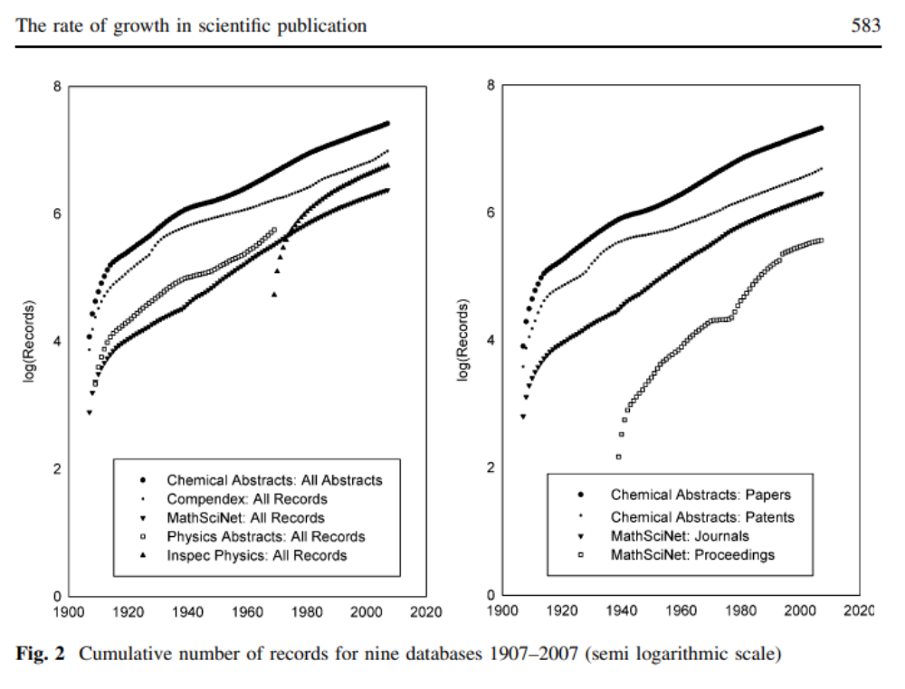
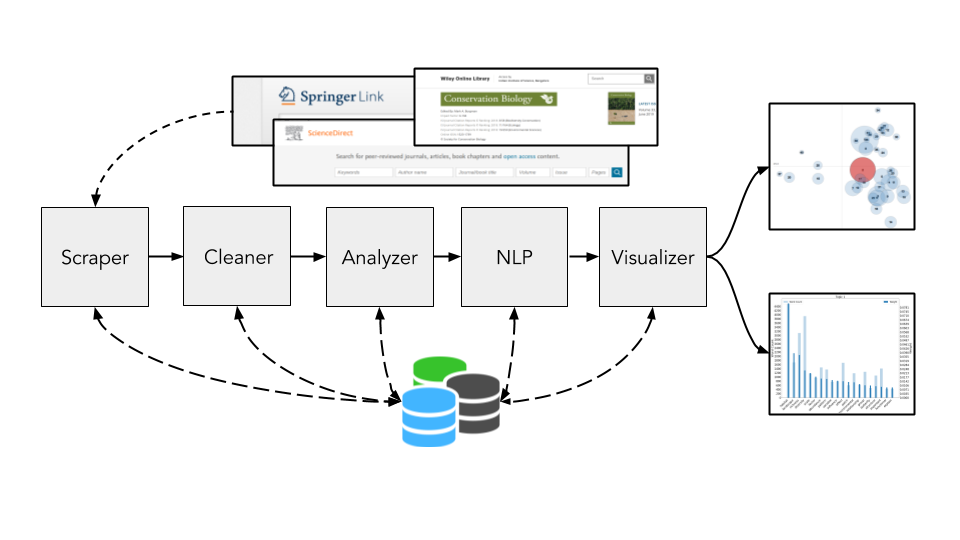
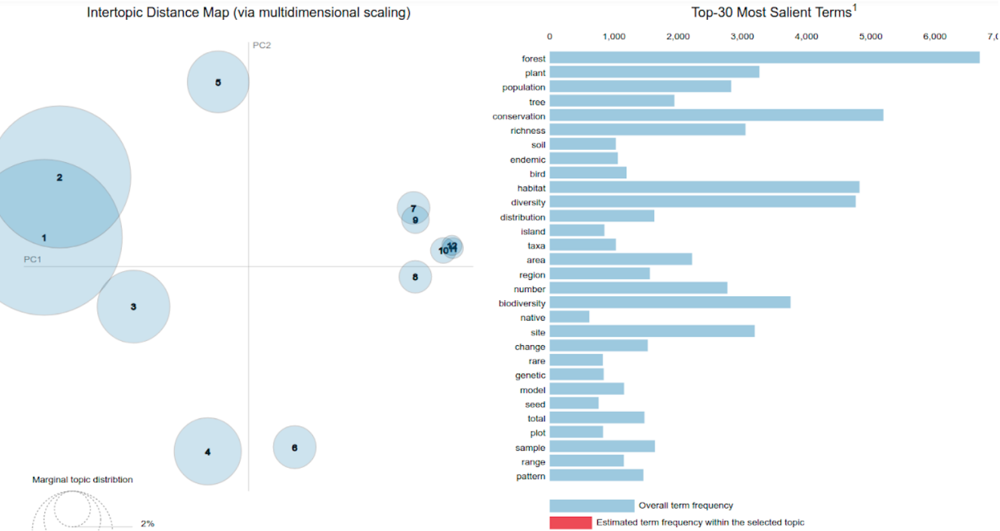
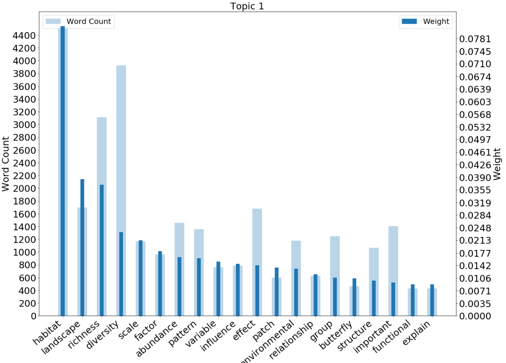

# ***pyResearchTrends:*** Analyzing research themes from academic publications

:warning: <strong>Code is buggy</strong> :warning:

### Contents
[**1.0 Introduction**](https://github.com/SarthakJShetty/Bias#10-introduction) <br>

[**2.0 Model Overview**](https://github.com/SarthakJShetty/Bias#20-model-overview) <br>

[**3.0 How it works**](https://github.com/SarthakJShetty/Bias#30-how-it-works) <br>

[**4.0 Installation Instructions**](https://github.com/SarthakJShetty/Bias#40-installation-instructions) <br>

[**5.0 Results**](https://github.com/SarthakJShetty/Bias#60-results) <br>

[**6.0 Citations**](https://github.com/SarthakJShetty/Bias#70-citations)


## 1.0 Introduction:

- Academic publishing has risen X-fold in the past ten years, making it nearly impossible to sift through a large number of papers and identify broad areas of research within disciplines.



<i>***Figure 1.1*** Increase in the number of scientific publications in the fields of physics and chemistry.</i>

- In order to *understand* such vast volumes of research, there is a need for **automated text analysis tools**.

- However, existing tools such as *Leximancer* are expensive and lack in-depth analysis of publications.

- To address these issues, we developed ***pyResearchTrends***, an open-source, automated text analysis tool that scrapes, analyzes and presents themes of research and other meta-data from scientific repositories.

- ***pyResearchTrends*** is an end-to-end tool to:
	- Scrape papers from scientific repositories,
	- Analyse meta-data such as date and journal of publication,
	- Present themes of research using natural language processing.

- To demonstrate the ability of this tool, we've analyzed the research themes from the field of Ecology & Conservation.

### 1.1 About:

This project is a collaboration <a title="Sarthak" href="https://SarthakJShetty.github.io" target="_blank"> Sarthak J. Shetty</a>, from the <a title="Aerospace Engineering" href="https://aero.iisc.ac.in" >Department of Aerospace Engineering</a>, <a title="IISc" href="https://iisc.ac.in" target="_blank"> Indian Institute of Science</a> and <a title="Vijay" href="https://evolecol.weebly.com/" target="_blank"> Vijay Ramesh</a>, from the <a title="E3B" href="http://e3b.columbia.edu/" target="_blank">Department of Ecology, Evolution & Environmental Biology</a>, <a href="https://www.columbia.edu/" title="Columbia University" target="_blank">Columbia University</a>.

## 2.0 Model Overview:
- The model is made up of three parts:

	1. <strong><a title="Scraper" href="https://github.com/SarthakJShetty/Bias/tree/master/Scraper.py/">Scraper</a>:</strong> This component scrapes scientific repository for publications containing the specific combination of keywords.

	2. <strong><a title="Analyzer" href="https://github.com/SarthakJShetty/Bias/tree/master/Analyzer.py/">Analyzer</a>:</strong> This component collects and measures the frequency of select keywords in the abstracts database.

	3. <strong><a title="Cleaner" href="https://github.com/SarthakJShetty/Bias/tree/master/Cleaner.py/">Cleaner</a>:</strong> This component cleans the corpus of text retreived from the repository and rids it of special characters that creep in during formatting and submission of manuscripts.

	4. <strong><a title="NLP Engine" href="https://github.com/SarthakJShetty/Bias/tree/master/NLP_Engine.py/">NLP Engine</a>:</strong> This component extracts insights from the abstracts collected by presenting topic modelling.

	5. <strong><a title="Visualizer" href="https://github.com/SarthakJShetty/Bias/tree/master/Visualizer.py/">Visualizer</a>:</strong> This component presents the results and data from the Analyzer to the end user.

## 3.0 How it works:
1. Representation of how the pipeline works to, i) retrieve publications, ii) clean the data, iii) infer topics and iv) present results.



<i>***Figure 3.1*** Diagramatic representation of pipeline for collecting papers and generating visualizations.</i>

### 3.1 Scraper:
- The <a title="Scraper" href="https://github.com/SarthakJShetty/Bias/blob/master/Scraper.py">```Scraper.py```</a> currently scrapes only the abstracts from <a title="Springer" href="https://www.link.Springer.com">Springer</a>.

- A default URL is provided in the code. Once the keywords are provided, the URLs are queried and the resultant webpage is souped and ```abstract_id``` is scraped.

- A new <a title="Abstract ID" target="_blank" href="https://github.com/SarthakJShetty/Bias/blob/master/LOGS/LOG_2018-08-29_15_4_Western_Ghats/Abstract_ID_Database_2018-08-29_15_4_1.txt">```abstract_id_database```</a> is prepared for each result page, and is referenced when a new paper is scraped.

- The <a title="Abstract Database" target="_blank" href="https://github.com/SarthakJShetty/Bias/blob/master/LOGS/LOG_2018-08-29_15_4_Western_Ghats/Abstract_Database_2018-08-29_15_4.txt">```abstract_database```</a> contains the abstract along with the title, author and a complete URL from where the full text can be downloaded. They are saved in a ```.txt``` file

- A <a title="Status Logger" href="https://github.com/SarthakJShetty/Bias/blob/master/LOGS/LOG_2018-08-29_15_4_Western_Ghats/Status_Logger_2018-08-29_15_4.txt" target="_blank">```status_logger```</a> is used to log the sequence of commands in the program.

### 3.2 Cleaner:
- The <a title="Cleaner" href="https://github.com/SarthakJShetty/Bias/tree/master/Cleaner.py/">```Cleaner.py```</a> cleans the corpus scrapped from the repository, before the  topic models are generated.

- This script creates a clean variant of the ```.txt``` corpus file that is then stored as ```_ANALYTICAL.txt```, for further analysis and modelling

### 3.3 Analyzer:
- The <a title="Analyzer" href="https://github.com/SarthakJShetty/Bias/tree/master/Analyzer.py/">```Analyzer.py```</a> analyzes the frequency of different words used in the abstract.

- It serves as an intermediary between the Scraper and the Visualizer, preparing the scraped data into a neat ```.csv``` <a title="Analyzer CSV file" href="https://github.com/SarthakJShetty/Bias/blob/master/LOGS/LOG_2019-02-14_11_13_Western_Ghats_Conservation/Abstract_Database_2019-02-14_11_13_FREQUENCY_CSV_DATA.csv">file</a>.

- This ```.csv``` file is then passed on to the Visualizer.

### 3.4 NLP Engine:

- The NLP Engine is used to generate the topic modelling charts for the [Visualizer.py](https://github.com/SarthakJShetty/Bias/tree/master/Visualizer.py) script. It generates the corpus and language model for analysis and use with other scripts.

- The corpus and model generated are then passed to the [Visualizer.py](https://github.com/SarthakJShetty/Bias/tree/master/Visualizer.py) script.

- The top modelling chart can be checked out [here](https://github.com/SarthakJShetty/Bias/blob/master/LOGS/LOG_2019-02-27_15_23_Eastern_Himalayas/Data_Visualization_Topic_Modelling.html). It is interactive and a detailed guide explaining its parts will be uploaded soon.

	**Note:** The ```.html``` file linked above has to be downloaded and opened in a JavaScript enabled browser to be viewed.

### 3.5 Visualizer:

- The <a title="Visualizer" href="https://github.com/SarthakJShetty/Bias/blob/master/Visualizer.py">```Visualizer.py```</a> code is responsible for generating the visualization associated with a specific search.

- Currently, the research theme visualization is functional. The trends histogram will soon be added.

- The research themes data visualization is stored as a <a title="Data Visualization" href="https://github.com/SarthakJShetty/Bias/blob/master/LOGS/LOG_2018-12-31_17_11_Western_Ghats_Ecology_Conservation_Policy/Data_Visualization.html">.html file</a> in the LOGS directory and can be viewed in the browser.

## 4.0 Installation Instructions:

### 4.1 Common instructions:

<strong>Note:</strong> These instructions are common to both Ubuntu and Windows systems. 

1.  Clone this repository:

		E:\>git clone https://github.com/SarthakJShetty/Bias.git

2. Change directory to the 'Bias' directory:

		E:\>cd Bias		

### 4.2 Virtualenv instructions:		

1. Install ```virtualenv``` using ```pip```:

		user@Ubuntu: pip install virtualenv

2. Create a ```virtualenv``` environment called "Bias" in the directory of your project:

		user@Ubuntu: virtualenv --no-site-packages Bias
	
	<strong>Note:</strong> This step usually takes about 30 seconds to a minute.

3. Activate the virtualenv enviroment:

		user@Ubuntu: ~/Bias$ source Bias/bin/activate

	You are now inside the ```Bias``` environment.

4. Install the requirements from 	<a title="Ubuntu Requirements" href="https://github.com/SarthakJShetty/Bias/blob/master/ubuntu_requirements.txt">```ubuntu_requirements.txt```</a>:
	
		(Bias) user@Ubuntu: pip3 install -r ubuntu_requirements.txt
		
	<strong>Note:</strong> This step usually takes a few minutes, depending on your network speed.

### 4.3 Conda instructions:

1. Create a new ```conda``` environment:
	
		E:\Bias conda create --name Bias python=3.5	

2. Enter the new ```Bias``` environment created:
	
		E:\Bias activate Bias

3. Install the required packages from <a href="https://github.com/SarthakJShetty/Bias/blob/master/conda_requirements.txt">```conda_requirements.txt```</a>:
		
		(Bias) E:\Bias conda install --yes --file conda_requirements.txt

	<strong>Note:</strong> This step usually takes a few minutes, depending on your network speed.


To run the code and generate the topic distribution and trend of research graphs:
		
		(Bias) E:\Bias python Bias.py --keywords="Western Ghats" --trends="Conservation"

- This command will scrape the abstracts from <a title="Springer" href="https://link.springer.com/" target="_blank">Springer</a> that are related to "Western Ghats", and calculate the frequency with which the term "Conservation" appears in their abstract.

## 5.0 Results:

Currently, the <a title="LOGS" href="https://github.com/SarthakJShetty/Bias/blob/master/LOGS/" target="_blank">results</a> from the various biodiversity runs are stored as tarballs, in the <a title="LOGS" href="https://github.com/SarthakJShetty/Bias/blob/master/LOGS/" target="_blank">LOGS</a>  folder, primarily to save space.

To view the logs, topic-modelling results & trends chart from the tarballs, run the following commands:

		tar zxvf <log_folder_to_be_unarchived>.tar.gz

**Example:**

To view the logs & results generated from the run on <a title="east Melanesian Islands" target="_blank" href="https://github.com/SarthakJShetty/Bias/blob/master/LOGS/LOG_2019-04-24_19_35_East_Melanesian_Islands.tar.gz">"East Melanesian Islands"</a>:

		tar zxvf LOG_2019-04-24_19_35_East_Melanesian_Islands.tar.gz

### 5.1 Topic Modelling Results:

The ```NLP_Engine.py``` module creates topic modelling charts such as the one shown below.



<i>***Figure 5.1*** Distribution of topics discussed in publications pulled from <a title="Ecology Journals" href="journals.md">8 conservation and ecology themed journals</a></i>.

- Circles indicate topics generated from the ```.txt``` file supplied to the ```NLP_Engine.py```, as part of the ```Bias``` pipeline.
- Each topic is made of a number of top keywords that are seen on the right, with an adjustable relevancy metric on top.
- More details regarding the visualizations and the udnerlying mechanics can be checked out [here](https://nlp.stanford.edu/events/illvi2014/papers/sievert-illvi2014.pdf).

### 5.2 Weights and Frequency Results:



<i>***Figure 5.2*** Here, we plot the variation in the weights and frequency of keywords falling under topic one from the chart <a title="Link to Topic Modelling charts" href="https://github.com/SarthakJShetty/Bias/tree/journal/#51-topic-modelling-results">above</a>.</i>

- Here, "weights" is a proxy for the importance of a specific keyword to a highlighted topic. The weight of a keyword is calculated by: i) absolute frequency and, ii) frequency of occurance with other keywords in the same topic.

- Factors i) and ii) result in variable weights being assigned to different keywords and emphasize it's importance in the topic.

### 5.3 Trends Result *:


<i>***Figure 5.3*** Variation in the frequency of a the term "Conservation" over time in the corpus of text scrapped.</i>

- Here, abstracts pertaining to [Eastern Himalayas](https://github.com/SarthakJShetty/Bias/blob/master/LOGS/LOG_2019-02-27_15_23_Eastern_Himalayas.tar.gz) were scrapped and temporally trend of occurance for "Conservation" was checked.
- The frequency is presented alongisde the bubble for each year on the chart.
- &ast; We are still working on how to effectively present the trends and usage variations temporally. This feature is not part of the main package.